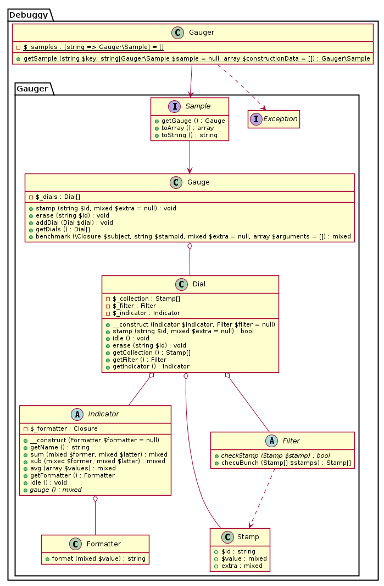

# The Gauger

#### [](https://travis-ci.org/dnsl48/Gauger)  [](https://coveralls.io/r/dnsl48/Gauger?branch=master) [](https://packagist.org/packages/debuggy/gauger)

Supported versions of PHP: 5.3, 5.4, 5.5, 5.6 and hhvm

License: `Apache License, Version 2.0`


#### What is the Gauger?
The Gauger is a highly extensible and comprehensive tool for a handy profiling PHP scripts and applications.


#### Goals of the project
The main goal of the project is to provide flexible and powerful abilities for profiling any data throughout an application. 
Moreover, a visual representation of the harvested data is quite important as well as the minimal amount of the boilerplate.


# Contents

 1. [Features](#features)  
 1.1. [Built-in](#built-in)  
 1.2. [Effortless](#effortless)  
 1.3. [Flexible](#flexible)  
 2. [Examples](#examples)  
 3. [Installation](#installation)  
 3.1. [Bootstrap](#bootstrap)  
 3.2. [Composer](#composer)  
 3.3. [PSR-4, manual installation](#psr-4-manual-installation)  
 4. [Documentation](#documentation)  
 4.1. [Comments in the source code](#comments in the source code)  
 4.2. [UML](#uml)  
 4.3. [This Readme](#this-readme)  
 4.3.1 [Totals](#totals)  
 4.3.2 [Timer](#timer)  
 4.3.3 [Extra data](#extra-data)  
 4.3.4 [Profiling without any overhead](#profiling-without-any-overhead)  
 4.3.5 [Subsections](#subsections)  
 4.3.6 [Postpone a report](#postpone-a-report)  
 4.3.7 [Refine data](#refine-data)  
 4.3.8 [What is next?](#what-is-next)  


## Features

#### Built-in
 * Indicators for measuring an elapsed time
([Microtime](src/Debuggy/Gauger/Indicator/Microtime.php), [TotalDuration](src/Debuggy/Gauger/Indicator/TotalDuration.php))
 * Indicators for measuring memory usage
([MemoryUsage](src/Debuggy/Gauger/Indicator/MemoryUsage.php), [MemoryPeak](src/Debuggy/Gauger/Indicator/MemoryPeak.php))
 * Ability to combine any indicators together for harvesting them at the same time
 * Calculation of a summary info about subsections of any depth including averages and totals

#### Effortless
 * Profiling without a headache about exceptions handling ([Stamp::benchmark](src/Debuggy/Gauger/Gauge.php#L88))
 * Make new indicators either through closures or extending the abstract Indicator ([Closure](src/Debuggy/Gauger/Indicator/Closure.php), [Indicator](src/Debuggy/Gauger/Indicator.php))
 * Shortcuts for the most frequent cases ([Samples](src/Debuggy/Gauger/Sample))
 * Static access to a profiler from any place of an application ([Gauger::getSample](src/Debuggy/Gauger.php#L34))

#### Flexible
 * Data produced by indicators can be of any complex type as well as of any scalar type
 * Any user-defined custom data can be kept while harvesting indicators ([Indicator\Extra](src/Debuggy/Gauger/Indicator/Extra.php))
 * The most critical code can be profiled without any overhead (see [Profiling without any overhead](#profiling-without-any-overhead))
 * Refine the harvested data for taking only the most interesting parts of it in the report


## Examples

There are several examples of the library usage in this readme. Here is the list with links and short descriptions of them:

 * [How to get a total duration and memory usage of an application](#totals)
 * [Timer in use](#timer)
 * [How to pass any user-defined extra data to a report while profiling](#extra-data)
 * [How to do profiling of the most critical parts of code without any overhead of the library usage](#profiling-without-any-overhead)
 * [How to deal with code folding, requests to databases or external servers](#subsections)
 * [How to refine harvested data; custom usage of the library's API](#refine-data)

## Installation

There are three possible ways of the Gauger installation.


#### Bootstrap

The easiest way is to include the library's bootstrap file `GaugerBootstrap.php` which will include the other files of the project. 
It allows to play with the tool without an effort of the installation.

```php
include $PATH_TO_THE_GAUGER.'/src/Debuggy/GaugerBootstrap.php';
```

#### Composer

To install the library with the Composer put the next code into your composer.json:

```json
{
	"require-dev": {
		"debuggy/gauger": "1.0"
	}
}
```
For more information about the Composer look at its official site: <https://getcomposer.org>


#### PSR-4, manual installation

In this case you only need an autoloader compatible with the `PSR-4` standard.
The library's package name (root namespace) is `Debuggy` which is in the directory `src`.


## Documentation

There are three pieces of documentation.


#### Comments in the source code

If you decide to fiddle with the library it'll be quite helpful to read the comments in the source code. It is fully covered with them. 
The main goal of these is one could understood the behaviour and implications of an entity by only reading its API and comments.


#### UML

All entities of the project are described with the PlantUML. These files are stored in the `uml/plantuml` directory. 
PlantUML is an Open-Source UML generator. For more information visit its site: <http://plantuml.com>


#### This Readme

The most essential concepts are explained here. These help to look at the tool from the top and begin to use it immediately.

Here is the list of the top layer entities:

 * `Gauger` : A static storage for samples
 * `Sample` : A shortcut for a use case (e.g., the sample `Timer` provides microtime profiling)
 * `Gauge` : A profiler entity; provides ability to gather several indicators together
 * `Dial` : Contains an Indicator and optionally its Filter, collects stamps of indicator's data
 * `Stamp` : [Business-Object](http://en.wikipedia.org/wiki/Business_object) that contains some data and its identifier
 * `Indicator` : Produces profiling data
 * `Filter` : Filters the produced data by some user defined criteria
 * `Formatter` : Converts data produced by the indicators into a string representation

Although [there is a diagram of these](uml/plantuml/gauger.png), for start using the library we have to deal with the first two entities only.
As mentioned, the samples are shortcuts for some use cases. It means that as long as we have a classic scenario, we only have to choose one of the samples and use it.


There are four built-in samples:
 * `Timer` : Shows microtime intervals that parts of code between stamps have taken
 * `Totals` : Shows application total duration and its memory peak usage
 * `Sample1` : Provides microtime and memory profiling
 * `Preload1` : Shows arrays of data as if they were harvested as stamps


Gauger is a static storage for samples, so that we can obtain them from every place of our code just calling its method `getSample`.
The first argument is a user-defined unique key for the sample throughout an application, whereas the second is its classname and has to be passed only once for each key.

##### Totals

Let's take a look at the simple example of using the `Totals` sample:

```php
$totals = Debuggy\Gauger::getSample ('anykey', 'Totals');
$totals->stamp ('Any name for the stamp');
echo $totals->toString ();
```

The result is gonna look like this:

```
*********************************** Totally ************************************
* Any name for the stamp ............................. TotalDuration: .007835  *
*                                                      MemoryPeak: 913KiB 208B *
********************************************************************************
```

On the left side of the report we see the name of the stamp "Any name for the stamp". It's always the same identifier we pass in the method `stamp`.
On the right side we see info about two indicators: `TotalDuration` and `MemoryPeak`.


##### Timer

Another example shows the `Timer` in use:

```php
$timer = Debuggy\Gauger::getSample (null, 'Timer');

foreach ([1, 2, 3] as $i) {
	$timer->stamp ('md5');
	for ($j = $i * 1e5; $j > 0; --$j) md5 ('foo');
	$timer->stamp ('md5');

	$timer->stamp ('sha1');
	for ($j = $i * 1e5; $j > 0; --$j) sha1 ('bar');
	$timer->stamp ('sha1');
}

echo $timer->toString ();
```

The result is gonna look like this:

```
*********************************** Stretchy ***********************************
* md5 ..................................................... Microtime: .115336 *
* md5 ..................................................... Microtime: .232095 *
* md5 ..................................................... Microtime: .344822 *
* sha1 .................................................... Microtime: .136728 *
* sha1 .................................................... Microtime: .271600 *
* sha1 .................................................... Microtime: .405101 *
********************************************************************************

*********************************** Summary ************************************
* md5 .......................................................... Microtime:    *
*                                                                 cnt: 3       *
*                                                                 sum: .692253 *
*                                                                 avg: .230751 *
* sha1 ......................................................... Microtime:    *
*                                                                 cnt: 3       *
*                                                                 sum: .813429 *
*                                                                 avg: .271143 *
********************************************************************************
```

We have two parts of the report. The first part is called `Stretchy` and it contains info about stretches.
A stretch is a part of code enclosed between two stamps. If we look at our example source code we'll see
that there are two stretches: `md5` and `sha1`. Each of them is a loop and is harvested three times.  
The part `Summary` shows us calculated summary for each stamp:
 * `cnt` count of the stretches of the stamp
 * `sum` sum of all values of the stamp
 * `avg` average value of the stamp


##### Extra data

Each sample contains an indicator that is invisible in simple cases. However it'll be shown if we pass
some extra data while making stamps. The indicator is called `Extra` and its only assignment is to keep any
user-provided extra data that could be passed as the second argument in the method `stamp`.

Let's take a look at the next example:

```php
$unpredictable = function () {
	$c = rand (1, 10000);
	for ($i = 0; $i < $c; ++$i);
	return $c;
};


$timer = Debuggy\Gauger::getSample (null, 'Timer');

foreach (range (1, 4) as $i) {
	$timer->stamp ('unpredictable function');
	$timer->stamp ('unpredictable function', $unpredictable ());
}

echo $timer->toString ();
```


The result shows us all unpredictable values:

```
*********************************** Stretchy ***********************************
* unpredictable function .................................. Microtime: .000974 *
*                                                           Extra: 6220        *
* unpredictable function .................................. Microtime: .000584 *
*                                                           Extra: 3933        *
* unpredictable function .................................. Microtime: .000174 *
*                                                           Extra: 1057        *
* unpredictable function .................................. Microtime: .001330 *
*                                                           Extra: 9137        *
********************************************************************************

*********************************** Summary ************************************
* unpredictable function ....................................... Microtime:    *
*                                                                 cnt: 4       *
*                                                                 sum: .003062 *
*                                                                 avg: .000766 *
*                                                                Extra:        *
*                                                                 cnt: 4       *
*                                                                 sum: 20347   *
*                                                                 avg: 5086.75 *
********************************************************************************
```


##### Profiling without any overhead


There are two indicators to do profiling without the library's overhead: `Extra` and `Preload`.
The easiest way is to use the sample `Preload1` because it contains most of the boilerplate we need.
Although it has almost all we need, it still would be nice to choose the data representation format.

There are four built-in formatters:
 * `Debuggy\Gauger\Formatter`: Default formatter that just converts values into strings
 * `Debuggy\Gauger\Formatter\Closure`: Provides possibility to make a custom formatter through a closure
 * `Debuggy\Gauger\Formatter\Memory`: Converts a number of bytes into either the [IEC](http://en.wikipedia.org/wiki/Binary_prefix#IEC_prefixes) (by default) or a metric representation
 * `Debuggy\Gauger\Formatter\Time`: Converts a float number (seconds with microseconds) into a number of days with a time and a microtime (6 digits by default)

The method `Gauger::getSample` takes the third argument as a list of arguments for the Sample constructor. In the next example we will initialize the sample with
the list of data for the stamps and the `Time` formatter:


```php
$stamps = [];

foreach ([1, 2, 3] as $i) {
	$a = microtime (true);
	md5 ('zzz');
	$b = microtime (true);
	sha1 ('zzz');
	$c = microtime (true);

	$stamps[] = ['md5', $a]; // the first is a name of a stamp, whereas the second is its value
	$stamps[] = ['md5', $b];
	$stamps[] = ['sha1', $b];
	$stamps[] = ['sha1', $c];
}

echo Debuggy\Gauger::getSample (
	null,
	'Preload1',
	[$stamps, new Debuggy\Gauger\Formatter\Time]
)->toString ();
```

The result is gonna be something like that:

```
************************************ Plainy ************************************
* md5 ......................................... Preload: 16464 11:12:14.491212 *
* md5 ......................................... Preload: 16464 11:12:14.491218 *
* sha1 ........................................ Preload: 16464 11:12:14.491218 *
* sha1 ........................................ Preload: 16464 11:12:14.491223 *
* md5 ......................................... Preload: 16464 11:12:14.491238 *
* md5 ......................................... Preload: 16464 11:12:14.491240 *
* sha1 ........................................ Preload: 16464 11:12:14.491240 *
* sha1 ........................................ Preload: 16464 11:12:14.491242 *
* md5 ......................................... Preload: 16464 11:12:14.491246 *
* md5 ......................................... Preload: 16464 11:12:14.491248 *
* sha1 ........................................ Preload: 16464 11:12:14.491248 *
* sha1 ........................................ Preload: 16464 11:12:14.491250 *
********************************************************************************

*********************************** Stretchy ***********************************
* md5 ....................................................... Preload: .000006 *
* md5 ....................................................... Preload: .000002 *
* md5 ....................................................... Preload: .000002 *
* sha1 ...................................................... Preload: .000005 *
* sha1 ...................................................... Preload: .000002 *
* sha1 ...................................................... Preload: .000002 *
********************************************************************************

*********************************** Summary ************************************
* md5 .......................................................... Preload:      *
*                                                                 cnt: 3       *
*                                                                 sum: .000010 *
*                                                                 avg: .000003 *
* sha1 ......................................................... Preload:      *
*                                                                 cnt: 3       *
*                                                                 sum: .000009 *
*                                                                 avg: .000003 *
********************************************************************************

*********************************** Totally ************************************
* Sample1 ............................................ TotalDuration: .008221  *
*                                                      MemoryPeak: 917KiB 608B *
********************************************************************************
```


##### Subsections

Sometimes we have some sections of the source code that are folded into each other. It would be handy if we could
profile those sections separately. There are two common cases how we want to do that: sometimes it is better to have
info about inner sections subtracted from info about outer ones, whereas occasionally they shouldn't be split.

If we deal with stretches, we can make notes about folding of those in stamps' identifiers so that the library could
calculate the data accordingly. The relations between stretches can be denoted in two ways: 
 * `->` when we want to subtract the inner stretch from the outer
 * `<-` when we want the outer info to include the inner one

The depth of a folding is unlimited. Let's imagine a method that makes a request to another server and we want to
profile it:

```php
$timer = Debuggy\Gauger::getSample (null, 'Timer');

$timer->stamp ('tough method');
usleep (50000); // build query (0.05 sec)
$timer->stamp ('tough method->rpc');
usleep (10000); // open socket (0.01 sec)
$timer->stamp ('tough method->rpc<-auth');
usleep (1000000); // auth (1 sec)
$timer->stamp ('tough method->rpc<-auth');
$timer->stamp ('tough method->rpc<-query');
usleep (2000000); // query (2 secs)
$timer->stamp ('tough method->rpc<-query');
usleep (10000); // close socket (0.01 sec)
$timer->stamp ('tough method->rpc');
usleep (50000); // parse response (0.05 sec)
$timer->stamp ('tough method');

echo $timer->toString ();
```

The result will show us something like this:

```
*********************************** Stretchy ***********************************
* tough method ............................................ Microtime: .100231 *
* tough method->rpc ..................................... Microtime: 03.020518 *
* tough method->rpc<-auth ............................... Microtime: 01.000130 *
* tough method->rpc<-query .............................. Microtime: 02.000129 *
********************************************************************************
```

Here we can see that the time of the method itself is only 0.1 second whereas the ->rpc part, that includes
opening and closing sockets with an authorization and a query, takes the whole 3 seconds.


##### Postpone a report

Sometimes we don't want to see the report immediately. In these cases we could save sample's data somewhere and
show it later. All samples make it possible through the method `Sample::toArray`. This method returns a php native
array that could be serialized and stored as a string (e.g., in a database). Later, when we want to look at the
report we could take this array and use the method `Presenter\Txt::represent`: this is exactly what does the method `Sample::toString`.


##### Refine data

The only one sample implies possibility to filter data: it's `Timer`. You can pass minimal and maximal values for stretches or even whole stamps
(totals of all stretches) in the constructor. However, when it comes to data refining there are few predictable cases we can manage in the samples.  
If you want to do your own refining of the data, you mostly have to make your own sample or just use all the parts of the library
straightforwardly. There are several places in the project you should look at in these cases:

* `Filter` : Provides ability to filter either single stamps or bunches of them
* `Dial` : Can contain a filter that is applied to all stamps while harvesting
* `Refiner` : Applies some logic to a bunch of stamps and can apply filters as well
* `Reporter` : Merges arrays of stamps of several indicators into a single array
* `Presenter` : Converts an array produced by a reporter into a human readable representation

As we can see, there are two places where we can filter stamps: `Dial` and `Refiner`. Lets take a look at the example of these components usage:

```php
use Debuggy\Gauger\Dial;
use Debuggy\Gauger\Filter;
use Debuggy\Gauger\Formatter;
use Debuggy\Gauger\Gauge;
use Debuggy\Gauger\Indicator;
use Debuggy\Gauger\Presenter;
use Debuggy\Gauger\Refiner;
use Debuggy\Gauger\Reporter;


$gauge = new Gauge; // if any dial does not pass its value to gauge, the whole stamp will be omitted

$gauge->addDial (new Dial (
	new Indicator\Extra (
		'keep?', // will try to get only values from this key of an array passed as an extra
		new Formatter\Stash // formatter Stash allows us to conceal this indicator from the report
	),
	new Filter\Equal (true) // this filter will be applied for each single stamp while a harvest
));
$gauge->addDial (new Dial (new Indicator\Extra ('value'))); // here we will keep our values

foreach (range (0, 11) as $i)
	$gauge->stamp ('evens', ['value' => $i, 'keep?' => ($i % 2 === 0)]);


// the root refiner provides a gauge encapsulation and always comes first
$refiner = new Refiner\Root ($gauge); 
$refiner = new Refiner\Filter (
	$refiner, // all other refiners take another refiner into a constructor
	new Filter\Between (1, 9) // this filter will be applied to the whole bunch of harvested stamps
); 


// The Plain reporter just produces a simple list of stamps and their values
$reporter = new Reporter\Plain;

// The report as an array
$dataAsArray = $reporter->recount ($refiner);

// Txt presenter makes a fancy text from an array
$presenter = new Presenter\Txt;
echo $presenter->represent (array ('Our title' => $dataAsArray));
```

The result is going to look like this:


```
********************************** Our title ***********************************
* evens ............................................................. Extra: 2 *
* evens ............................................................. Extra: 4 *
* evens ............................................................. Extra: 6 *
* evens ............................................................. Extra: 8 *
********************************************************************************
```


##### What is next?

If you want to have something more complex than the samples can do, you're welcome to look at the library sources.
A very good place to begin is the samples. They are not only shortcuts but the samples how you can use the API of the library.

Please feel free to make pull-requests or issues if you know any ways to improve the library or this readme (e.g., if you
see any grammatical errors or can suggest any new sections of the documentation).

Moreover, you can find the UML diagrams of the project in the directory `uml`. A good one to start with is the diagram of the top level entities (gauger.pu):

